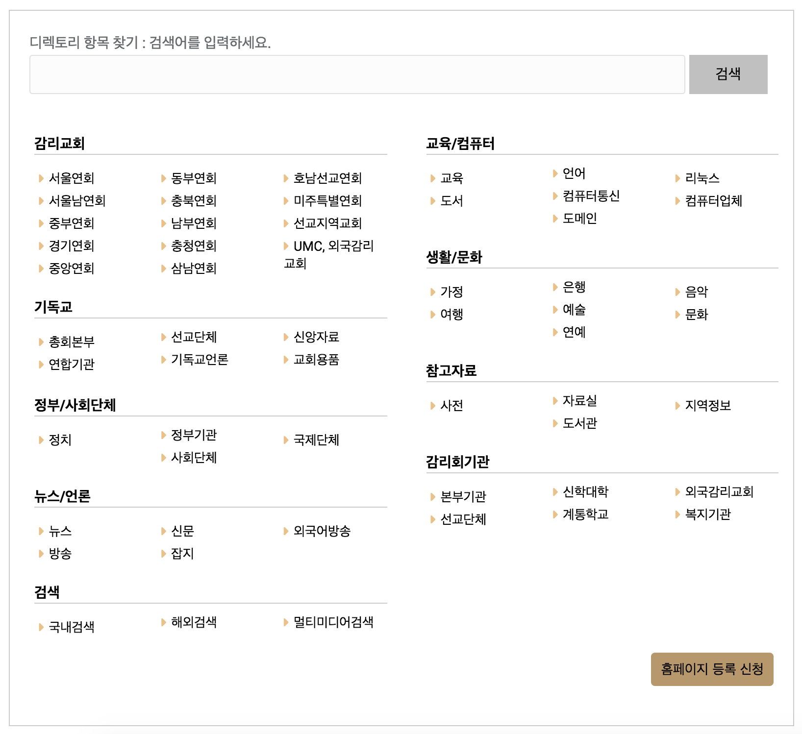
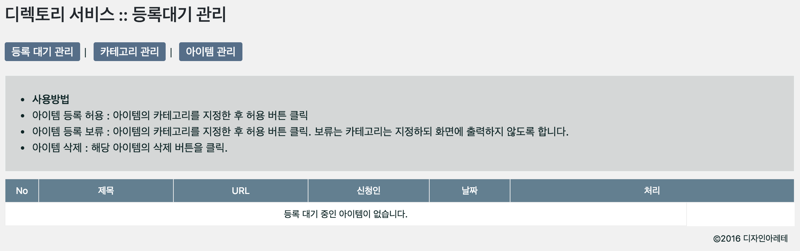
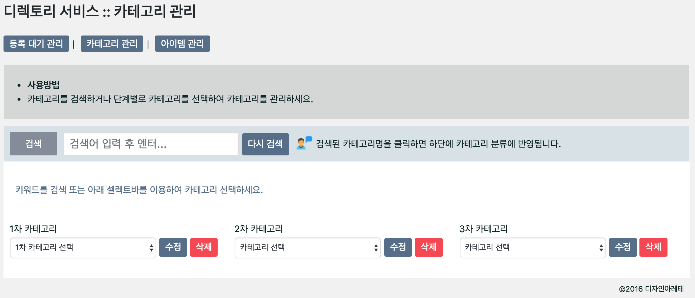

# DW Directory Service
이 플러그인은 워드프레스에서 디렉토리 서비스를 할 수 있도록 고안되었습니다.
지역 커뮤니티 사이트에서 지역의 맛집 등을 소개하는 용도나 교회 홈페이지에서 교우 사업장을 소개하는 용도로 사용하려고 개발했는데 사용하기 나름이겠지요.
  
  
## 사용법
***
아래 shortcode를 적용하고자 하는 페이지에 붙여넣으면 됩니다.
~~~~
[dw-directory]
~~~~
  
로그인 후 관리자 페이지에서 "디렉토리 서비스"라는 메뉴를 클릭하시면 카테고리 관리, 아이템 관리, 등록 대기 관리를 할 수 있습니다.
    
    
  
## 스크린샷
  
### 서비스 화면  

  
  
  
### 관리자 화면 : 등록대기관리    

  
  
  
### 관리자 화면 : 카테고리 관리  

  
  
  
### 관리자 화면 : 아이템 관리  

  
  
## 데모 사이트
<https://dev.daworks.io>

## License
DW Directory Service 플러그인은 출처를 표기한 후 자유롭게 사용하실 수 있습니다.
MIT License.

## 제작자
* 디자인아레테
* 이덕형 (dhlee@daworks.io)
* <https://daworks.io/>
